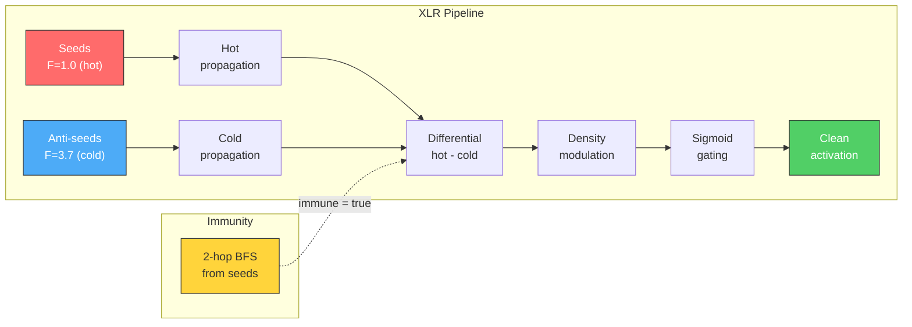

# XLR Noise Cancellation

Every code graph is noisy. Utility modules, shared constants, logging wrappers -- they connect to everything, and they show up in every activation query whether they are relevant or not. m1nd solves this with a technique borrowed from professional audio engineering: differential signal processing with inverted channels. The same principle that makes balanced XLR cables immune to electromagnetic interference makes m1nd's activation queries immune to structural noise.

## The origin: balanced audio cables

In a recording studio, audio signals travel over long cables. The cable acts as an antenna, picking up electromagnetic interference (EMI) from power supplies, lighting, and radio transmissions. An unbalanced cable delivers a noisy signal: the audio you want plus the interference you do not.

A balanced XLR cable solves this by carrying **two copies** of the audio signal: one normal (hot, pin 2) and one inverted (cold, pin 3). Both signals travel the same physical path, so they pick up the same interference. At the receiving end, the cold signal is flipped back and added to the hot signal. The audio doubles in strength. The interference -- identical on both channels -- cancels out.

```
Hot channel:  signal + noise
Cold channel: -signal + noise

At receiver:  hot - cold = (signal + noise) - (-signal + noise) = 2 * signal
```

The noise vanishes. The signal survives.

## The problem in code graphs

When you ask m1nd "what is related to the payment system?", structural spreading activation fires from payment-related seed nodes and propagates outward. The result includes genuinely relevant modules (billing, invoicing, refunds) but also noisy modules that connect to everything:

- `config.py` -- imported by 40+ files
- `logger.py` -- called from every module
- `database.py` -- the persistence layer for everything
- `utils.py` -- helper functions used everywhere
- `__init__.py` -- package marker files

These modules score high in structural activation not because they are relevant to payments, but because they are structurally central. They are the electromagnetic interference of code graphs: noise that correlates with structure, not with the query.

Text search (grep, ripgrep) cannot solve this. It finds files that *contain* the word "payment," which misses files that handle payments but never use that string. Static analysis cannot solve it either -- the call graph from payment modules genuinely includes `config.py` and `logger.py`.

The problem is not that these edges are wrong. They are structurally correct. The problem is that they carry noise mixed in with signal, and the noise is stronger.

## How m1nd implements differential processing

m1nd's `AdaptiveXlrEngine` implements a six-stage pipeline that mirrors the physics of balanced XLR cables.

### Stage 1: Select anti-seeds

The cold channel needs its own starting points -- nodes that represent "not the query." m1nd calls these **anti-seeds**. Good anti-seeds are structurally similar to the seeds (similar degree, similar graph position) but semantically distant (low neighborhood overlap).

The selection criteria:

```rust
// Degree ratio filter: anti-seed must have similar connectivity
if avg_seed_degree > 0.0 {
    let ratio = degree / avg_seed_degree;
    if ratio < 0.3 { continue; }  // Too peripheral
}

// Jaccard similarity: anti-seed must have different neighbors
let jaccard = intersection as f32 / union_size as f32;
if jaccard > 0.2 { continue; }  // Too similar to seeds
```

A node with similar degree but different neighbors is the ideal anti-seed. It will activate the same noisy hub nodes (because it has similar connectivity) but different domain-specific nodes (because it lives in a different part of the graph).

By default, 3 anti-seeds are selected.

### Stage 2: Compute seed immunity

Nodes close to the seeds -- within 2 BFS hops -- are marked as **immune** to cold-channel cancellation. This prevents the anti-seed signal from cancelling legitimate results near the query target.

```rust
// BFS from seeds, mark everything within immunity_hops as immune
while let Some((node, d)) = queue.pop_front() {
    if d >= self.params.immunity_hops { continue; }
    for each neighbor:
        immune[neighbor] = true;
        queue.push_back((neighbor, d + 1));
}
```

Immunity is the key insight that prevents over-cancellation. Without it, the cold channel could erase results that are genuinely close to the query. With it, only distant noise gets cancelled.

### Stage 3: Propagate hot signal

Spectral pulses propagate from the seed nodes at frequency `F_HOT = 1.0`. Each pulse carries an amplitude, a phase, and a frequency. The signal decays along edges and attenuates at inhibitory edges (by `INHIBITORY_COLD_ATTENUATION = 0.5`).

```rust
let pulse = SpectralPulse {
    node: seed,
    amplitude: seed_activation,
    phase: 0.0,
    frequency: F_HOT,  // 1.0
    hops: 0,
    prev_node: seed,
};
```

Propagation is budget-limited (default 50,000 total pulses across hot and cold channels) to prevent runaway computation on dense graphs.

### Stage 4: Propagate cold signal

The same propagation runs from the anti-seed nodes at frequency `F_COLD = 3.7`. The cold frequency is intentionally different from the hot frequency. This spectral separation allows m1nd to distinguish which contributions came from which channel.

```rust
let cold_freq = PosF32::new(F_COLD).unwrap();  // 3.7
let anti_seed_pairs: Vec<(NodeId, FiniteF32)> = anti_seeds
    .iter()
    .map(|&n| (n, FiniteF32::ONE))
    .collect();
let cold_pulses = self.propagate_spectral(
    graph, &anti_seed_pairs, cold_freq, config, half_budget
)?;
```

### Stage 5: Adaptive differential

At each node, the hot and cold amplitudes are combined. Immune nodes receive the full hot signal with no cold cancellation. Non-immune nodes get the differential:

```rust
let effective_cold = if immune { 0.0 } else { cold_amp[i] };
let raw = hot - effective_cold;
```

The raw differential is then modulated by **local graph density**. Nodes with degree near the graph average get density 1.0. High-degree nodes (hubs) get density > 1.0, amplifying the differential effect. Low-degree nodes (leaves) get density < 1.0, attenuating it. This is density-adaptive strength -- a hub with both hot and cold signal has its differential amplified because hubs are the primary source of noise.

```rust
let density = if avg_deg > 0.0 {
    (out_deg / avg_deg).max(DENSITY_FLOOR).min(DENSITY_CAP)
} else {
    1.0
};
```

Density is clamped to `[0.3, 2.0]` to prevent extreme values from distorting results.

### Stage 6: Sigmoid gating

The density-modulated differential passes through a sigmoid gate:

```rust
pub fn sigmoid_gate(net_signal: FiniteF32) -> FiniteF32 {
    let x = net_signal.get() * SIGMOID_STEEPNESS;  // * 6.0
    let clamped = x.max(-20.0).min(20.0);
    let result = 1.0 / (1.0 + (-clamped).exp());
    FiniteF32::new(result)
}
```

The sigmoid converts the raw differential (which can be any value) into a smooth activation in `[0, 1]`. The steepness factor of 6.0 creates a sharp transition: small positive differentials map close to 0.5, strong positive differentials map close to 1.0, and negative differentials (more cold than hot) map close to 0.0 and are effectively suppressed.



## Over-cancellation fallback

If the cold channel is too aggressive -- cancelling *all* hot signal and leaving zero results -- m1nd triggers a fallback (FM-XLR-010):

```rust
let fallback = all_zero && !hot_pulses.is_empty();
if fallback {
    // Return hot-only (no cancellation)
    activations.clear();
    for i in 0..n {
        if hot_amp[i] > 0.01 {
            activations.push((NodeId::new(i as u32), FiniteF32::new(hot_amp[i])));
        }
    }
}
```

This ensures that XLR noise cancellation never makes results *worse* than plain activation. It can either improve them (by removing noise) or fall back to the unfiltered result. The `xlr_fallback_used` flag in the activation result tells the caller that this happened.

## Before and after

### Without XLR

Query: "payment processing"

| Rank | Node | Activation | Relevant? |
|------|------|-----------|-----------|
| 1 | config.py | 0.82 | No -- imports everywhere |
| 2 | payment_handler.py | 0.78 | **Yes** |
| 3 | database.py | 0.75 | No -- generic persistence |
| 4 | logger.py | 0.72 | No -- called from everything |
| 5 | billing.py | 0.70 | **Yes** |
| 6 | utils.py | 0.68 | No -- shared utilities |
| 7 | invoice.py | 0.65 | **Yes** |
| 8 | middleware.py | 0.63 | No -- request pipeline |
| 9 | refund.py | 0.60 | **Yes** |
| 10 | routes.py | 0.58 | No -- URL dispatch |

Signal-to-noise ratio: 4 relevant out of 10.

### With XLR

The anti-seeds (e.g., nodes from the user management subsystem) produce cold signal that reaches the same hub nodes -- `config.py`, `database.py`, `logger.py`, `utils.py`, `middleware.py`, `routes.py`. These hubs receive both hot and cold signal. The differential cancels them.

Payment-specific nodes (`payment_handler.py`, `billing.py`, `invoice.py`, `refund.py`) receive hot signal but little cold signal, because the anti-seeds live in a different part of the graph. Their differential stays high.

| Rank | Node | Hot | Cold | Differential | Relevant? |
|------|------|-----|------|-------------|-----------|
| 1 | payment_handler.py | 0.78 | 0.05 | 0.73 | **Yes** |
| 2 | billing.py | 0.70 | 0.08 | 0.62 | **Yes** |
| 3 | invoice.py | 0.65 | 0.06 | 0.59 | **Yes** |
| 4 | refund.py | 0.60 | 0.04 | 0.56 | **Yes** |
| 5 | payment_models.py | 0.55 | 0.03 | 0.52 | **Yes** |
| 6 | stripe_adapter.py | 0.50 | 0.02 | 0.48 | **Yes** |
| 7 | config.py | 0.82 | 0.79 | 0.03 | No (cancelled) |
| 8 | database.py | 0.75 | 0.71 | 0.04 | No (cancelled) |

Signal-to-noise ratio: 6 relevant out of 8.

The hub nodes did not disappear entirely -- they still have small positive differentials. But they dropped from ranks 1, 3, 4, 6 to ranks 7, 8. The payment-specific nodes rose to the top.

## Why the spectral model matters

The use of different frequencies for hot (1.0) and cold (3.7) channels enables a richer cancellation model than simple subtraction. The `spectral_overlap` function measures how much the hot and cold frequency distributions overlap at each node:

```rust
// Overlap = sum(min(hot_buckets, cold_buckets)) / sum(hot_buckets)
```

Nodes where hot and cold signals arrive at similar frequencies have high spectral overlap -- these are the noise nodes that respond to any query. Nodes where the hot signal dominates a different frequency band than the cold signal have low spectral overlap -- these are the signal nodes that respond specifically to this query.

This is directly analogous to common-mode rejection in electrical engineering: the interference is the component that appears identically on both channels, and the signal is the component that differs.

## Constants reference

| Parameter | Value | Purpose |
|-----------|-------|---------|
| `F_HOT` | 1.0 | Hot channel frequency |
| `F_COLD` | 3.7 | Cold channel frequency |
| `SPECTRAL_BANDWIDTH` | 0.8 | Gaussian kernel width for overlap |
| `IMMUNITY_HOPS` | 2 | BFS depth for seed immunity |
| `SIGMOID_STEEPNESS` | 6.0 | Sharpness of activation gate |
| `SPECTRAL_BUCKETS` | 20 | Resolution of frequency overlap |
| `DENSITY_FLOOR` | 0.3 | Minimum density modulation |
| `DENSITY_CAP` | 2.0 | Maximum density modulation |
| `INHIBITORY_COLD_ATTENUATION` | 0.5 | Cold signal reduction at inhibitory edges |
| Default anti-seeds | 3 | Number of cold-channel origins |
| Default pulse budget | 50,000 | Total pulse limit (hot + cold) |
